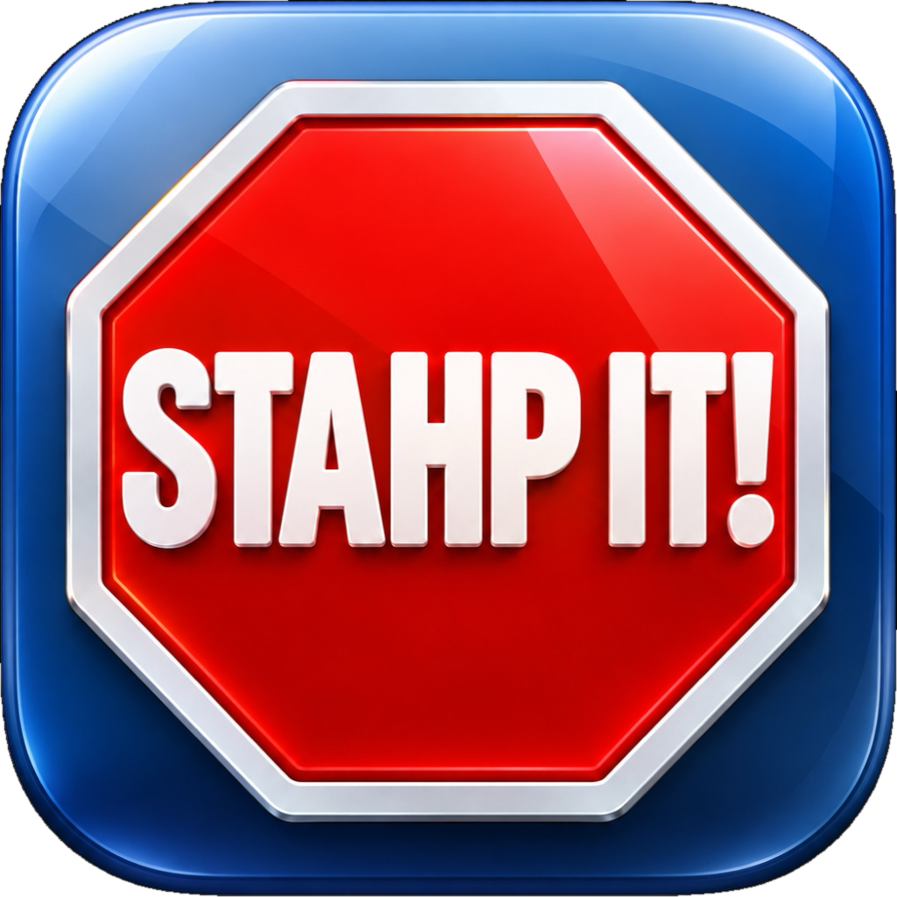

# STAHP IT! ⏱️

> **The hyper-native macOS task stopwatch & Dynamic Island utility.**  
> *Zero-nit OLED notch integration, ProMotion 120Hz physics, magnetic screen edge docking, and intelligent frontmost app tracking.*

---

<p align="center">
  
</p>

<p align="center">
  
  
  
  
  
</p>

> [!NOTE]
> **🚧 Active Development**: **STAHP IT!** is currently under active development (`v0.6`). APIs, features, and UI interactions are evolving rapidly. Feedback and issue reports are warmly welcomed!

---

## ✨ Features

### 🖥️ Hardware-Calibrated MacBook Notch Dynamic Island
- **True Black `#000000`**: Background fill is calibrated to pure zero-nit black, turning off mini-LED dimming zones and OLED pixels with **zero gray backlight bleed** against the physical MacBook Pro notch.
- **Responsive Symmetrical Wings ($W_{\text{left}} = W_{\text{right}}$)**: Left wing terminates flush at the notch camera housing, and the right stopwatch wing begins flush from the right boundary. Symmetrical padding expands responsively with task text length.
- **Hover-Only Aurora Light Sheen**: Ambient Apple Intelligence aurora glow contour stays completely off during work sessions and only blooms with smooth rotation on mouse hover.
- **Expandable Island**: Hover or click to expand into a full stopwatch control center with large monospaced digits, lap records, play/pause, finish session, and quick category selector.

### 🧲 Magnetic Screen Edge Snapping & Docking
- **Multi-Anchor Magnetic Snapping**: Drag the overlay near any screen boundary to snap it into place:
  - **Top Center Notch** (MacBook Dynamic Island mode)
  - **Left & Right Screen Edges** (Ultra-compact vertical pill with stacked monospaced digits)
  - **Top & Bottom Screen Edges** (Horizontal compact dock pill)
  - **Free Floating** (Custom positioned anywhere across displays)
- **Auto-Minimize to Edge**: Automatically condenses into a low-profile edge indicator with live pulsing task dot.

### 🔄 Automatic Session Persistence & Auto-Resume
- **Crash & Restart Resilience**: Saves live active session snapshots every 4 seconds and upon app termination (`willTerminateNotification` / `willSleepNotification`).
- **Seamless Resume**: Relaunching the app remembers your exact elapsed time, active task category, and recorded lap splits.
- **Auto-Resume Running Timers**: If the stopwatch was actively tracking before quitting, it immediately resumes ticking on app launch.

### 🏷️ Custom Task Categories & Manager
- **Custom Presets**: Create, edit, and organize unlimited task categories with custom hex colors and Apple SF Symbols.
- **Target Goal Minutes**: Set optional daily focus targets per category with visual progress tracking.
- **One-Click Switcher**: Switch active tasks on the fly from the Notch HUD, Menu Bar, or Dashboard.

### 🔍 Active Application Tracking
- **Frontmost App Awareness**: Automatically detects which macOS app is in focus (e.g. *Xcode*, *Figma*, *Safari*, *Final Cut Pro*) and pairs it with your active session.
- **Custom HUD Display Modes**: Toggle between showing Task Category, Active App Name, or Both (`Coding • Xcode`).

### 📊 Dashboard, History & Safe Export
- **Session History Log**: Grouped daily logs with total time summaries, category breakdowns, and lap splits.
- **Formula-Safe CSV & Markdown Export**: Sanitizes dangerous spreadsheet formula prefixes (`=`, `+`, `-`, `@`) and exports cleanly formatted Markdown tables.

---

## ⌨️ Global Keyboard Shortcuts

| Shortcut | Action | Scope |
| :--- | :--- | :--- |
| `⌥` `⇧` `Space` | **Start / Pause Stopwatch** | Global (Carbon) |
| `⌥` `⇧` `N` / `⌥` `⇧` `O` | **Toggle Notch HUD / Overlay Visibility** | Global (Carbon) |
| `⌥` `⇧` `S` | **Finish & Save Current Session** | Global (Carbon) |
| `⌘` `,` | **Open Settings Dialog** | App Active |
| `⌘` `0` | **Open Dashboard & History** | App Active |

---

## 🚀 Installation & Running

### Prerequisites
- macOS 14.0 (Sonoma) or macOS 15.0+ (Sequoia)
- Apple Silicon (M1/M2/M3/M4) or Intel Mac
- Swift 5.9+ / Swift 6.0

### Quick Start
Clone the repository and run the build script:

```bash
git clone https://github.com/yymannyy/STAHP-IT.git
cd STAHP-IT
chmod +x run.sh
./run.sh
```

The script builds the release binary, bundles `AppIcon.icns`, generates the `.app` bundle at `build/STAHP IT!.app`, and launches the application.

---

## 🛠️ Project Architecture

```
STAHP IT!/
├── Package.swift                     # Swift Package Manager manifest
├── AppIcon.icns                      # macOS multi-density application icon bundle
├── AppIcon.png                       # Primary high-resolution transparent application icon
├── stahpit-bluebg.png                # Alternate icon variant (Ocean Blue background)
├── stahpit-lightbluebg.png           # Alternate icon variant (Sky Blue background)
├── stahpit-whitebg.png               # Alternate icon variant (Clean White background)
├── run.sh                            # Release build, icon packaging & launch script
└── Sources/
    ├── App/
    │   ├── StahpItApp.swift          # Main App lifecycle & MenuBarExtra scene
    │   ├── AppState.swift            # Central @MainActor state coordinator & persistence
    │   └── HotkeyManager.swift       # Carbon global keyboard shortcut listener
    ├── Engine/
    │   ├── StopwatchEngine.swift     # High-precision 60-120Hz ProMotion timer engine
    │   ├── TimeFormatter.swift       # Stopwatch, vertical pill & duration string formatters
    │   └── AppleTheme.swift          # Apple HIG design tokens, springs & notch geometry
    ├── Models/
    │   ├── TaskItem.swift            # Task category schema & color hex extensions
    │   └── TimeSession.swift         # Historical session & active snapshot schema
    ├── Storage/
    │   └── StorageManager.swift      # JSON store, settings schema & CSV/MD export
    └── Views/
        ├── MenuBar/
        │   └── MenuBarView.swift     # Native macOS Menu Bar status item view
        ├── Overlay/
        │   ├── OverlayPanel.swift    # AppKit NSPanel magnetic edge snapping & drag controller
        │   └── OverlayHUDView.swift  # OLED Notch Dynamic Island & Edge Dock Pills
        └── Dashboard/
            ├── SettingsView.swift    # Tabbed Settings dialog
            ├── SettingsWindowController.swift # NSWindowController for Settings window
            ├── DashboardWindowView.swift      # NavigationSplitView Dashboard
            ├── HistoryView.swift              # Session history log & export
            ├── TaskManagerView.swift          # Category list & editor
            └── SessionCompletionSheet.swift   # Finish session notes sheet
```

---

## 📄 License

This project is licensed under the **MIT License** — see the [LICENSE](LICENSE) file for details.
